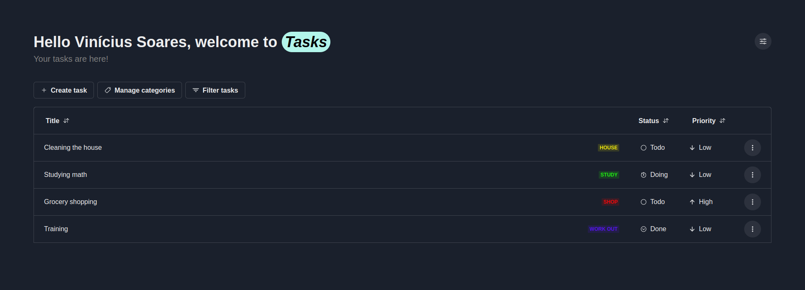

<h1 align="center">TasksApp</h1>
 
---
 
## 📝 Tabela de conteúdo
-   [Sobre](#about)
-   [Preview](#demo)
-   [Construído usando](#built_using)
-   [Rodando o projeto](#getting_started)
-   [Autor](#authors)
 
## 🧐 Sobre <a name = "about"></a>
 
Interface para gerenciamento de usuários, categorias e tarefas.
 
## 🎥 Preview <a name = "demo"></a>
 
<a href="https://github.com/Vsspaulasouza/TasksApp">
</img>
</a>
 
## ⛏️ Construído usando <a name = "built_using"></a>
 
-   [React](https://react.dev/) - Framework Javascript para criação de aplicações web
- [Chakra UI](https://chakra-ui.com/) - Biblioteca de componentes 
 
## 🏁 Rodando o projeto <a name = "getting_started"></a>
 
Siga as seguintes instruções para rodar a aplicação em sua máquina.

### Pré-requisitos

Para executar esse projeto, você vai precisar do [Node](https://nodejs.org/pt-br/) e seu gerenciador de pacotes(npm) instalado em sua máquina.

Faça o clone do projeto e siga para seção de instalação

```shell
gh repo clone Vsspaulasouza/TasksApp
```

### Instalação

Abra a pasta do projeto e acesse a pasta da aplicação frontend

```shell
cd task-frontend
```

Instale todas as dependências do projeto

```shell
npm i
```

Após instalar as dependências, basta executar o projeto

```shell
npm run dev
```

Após isso será gerado um link para acesso à aplicação rodando em seu ambiente local.

---

## ✍️ Autor <a name = "authors"></a>

| [](https://github.com/Vsspaulasouza) |
| -------------------------------------------------------------------------------------------------------------- |

| [Vinícius Soares](https://github.com/Vsspaulasouza)
